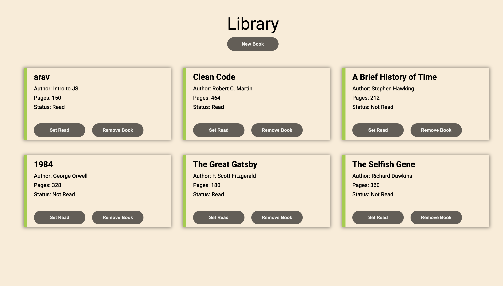

## Library

It is a library where you can enter Book title, author, number of pages and checkbox whether you have finished reading or not.

## Features
- New Book
- Book title
- Author
- Pages
- Read
- Remove

## Learnings
- How to use grid to layout cards of different books.
- Learned how to use constructors and dialogs.
- DOM Manipulations.

## Image

 

## Live demo

[ View Live  :)](https://gmarav05.github.io/Library/)
 